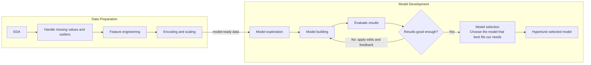

# Project Roadmap

```mermaid
flowchart LR
    subgraph PREP["Data Preparation"]
        A["EDA"] --> B["Handle missing values and outliers"]
        B --> C["Feature engineering"]
        C --> D["Encoding and scaling"]
    end

    subgraph MODEL["Model Development"]
        E["Model exploration"] --> F["Model building"]
        F --> R["Evaluate results"]
        R --> Q{"Results good enough?"}
        Q -->|"No: apply edits and feedback"| F
        Q -->|"Yes"| G["Model selection<br/>Choose the model that best fits our needs"]
        G --> H["Hypertune selected model"]
    end

    D -->|"model-ready data"| E
```
