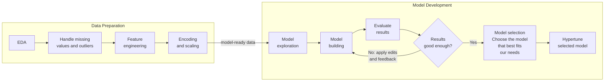

# Project Roadmap

```mermaid
flowchart LR
    subgraph PREP["Data Preparation"]
        A["EDA"] --> B["Handle missing<br/>values and outliers"]
        B --> C["Feature<br/>engineering"]
        C --> D["Encoding<br/>and scaling"]
    end

    subgraph MODEL["Model Development"]
        E["Model<br/>exploration"] --> F["Model<br/>building"]
        F --> R["Evaluate<br/>results"]
        R --> Q{"Results<br/>good enough?"}
        Q -->|"No: apply edits<br/>and feedback"| F
        Q -->|"Yes"| G["Model selection<br/>Choose the model<br/>that best fits<br/>our needs"]
        G --> H["Hypertune<br/>selected model"]
    end

    D -->|"model-ready data"| E
```
