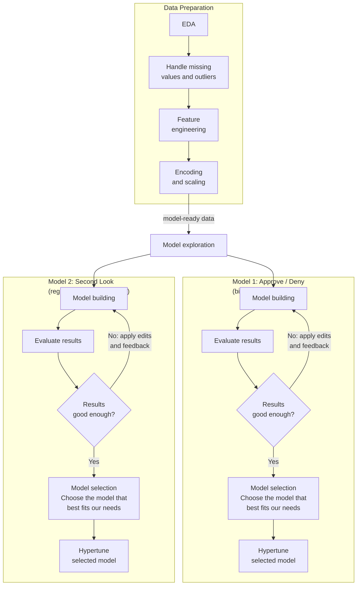
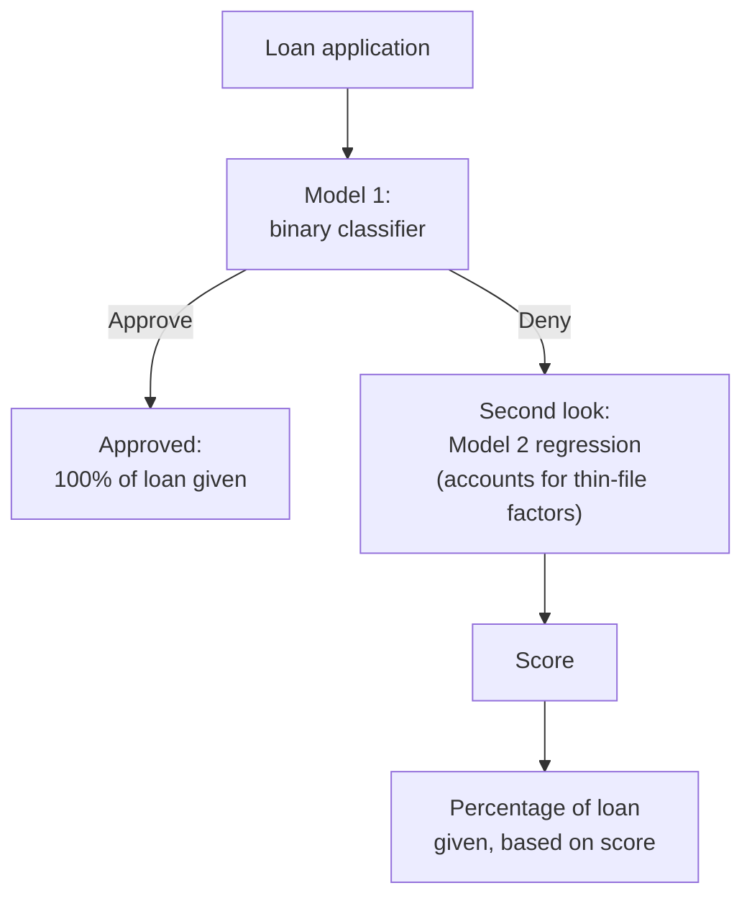

# Project Roadmap

## Work plan

```mermaid
flowchart TD
    subgraph PREP["Data Preparation"]
        A["EDA"] --> B["Handle missing<br/>values and outliers"]
        B --> C["Feature<br/>engineering"]
        C --> D["Encoding<br/>and scaling"]
    end

    D -->|"model-ready data"| E["Model exploration"]

    subgraph CLF["Model 1: Approve / Deny<br/>(binary classification)"]
        F1["Model building"] --> R1["Evaluate results"]
        R1 --> Q1{"Results<br/>good enough?"}
        Q1 -->|"No: apply edits<br/>and feedback"| F1
        Q1 -->|"Yes"| G1["Model selection<br/>Choose the model that<br/>best fits our needs"]
        G1 --> H1["Hypertune<br/>selected model"]
    end

    subgraph REG["Model 2: Second Look<br/>(regression, thin-file factors)"]
        F2["Model building"] --> R2["Evaluate results"]
        R2 --> Q2{"Results<br/>good enough?"}
        Q2 -->|"No: apply edits<br/>and feedback"| F2
        Q2 -->|"Yes"| G2["Model selection<br/>Choose the model that<br/>best fits our needs"]
        G2 --> H2["Hypertune<br/>selected model"]
    end

    E --> F1
    E --> F2
```

## How the two models work together

```mermaid
flowchart TD
    X["Loan application"] --> M1["Model 1:<br/>binary classifier"]
    M1 -->|"Approve"| Y["Approved:<br/>100% of loan given"]
    M1 -->|"Deny"| SL["Second look:<br/>Model 2 regression<br/>(accounts for thin-file factors)"]
    SL --> S["Score"]
    S --> P["Percentage of loan<br/>given, based on score"]
```
